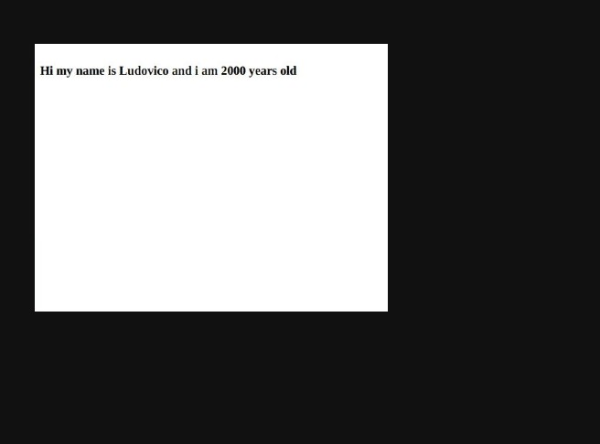
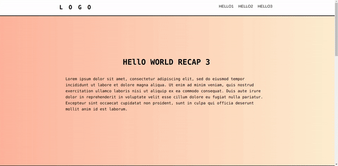

# PROPS

## A series of recapitulative REACT projects

## Projects like this one will be accompanied by a video explanation related to the topic.

 

 “Props” is a special keyword in React, which stands for properties and is being used for passing data from one component to another. Furthermore, props data is read-only, which means that data coming from the parent should not be changed by child components.

### click on the image to watch the the videos:

#### Simple (it contains no sass customization).

##### no.1

 

##### no.2

[video2](https://youtu.be/UxRyPk2zc4c)

 
 
 
 

#### SASS customized

 
 
